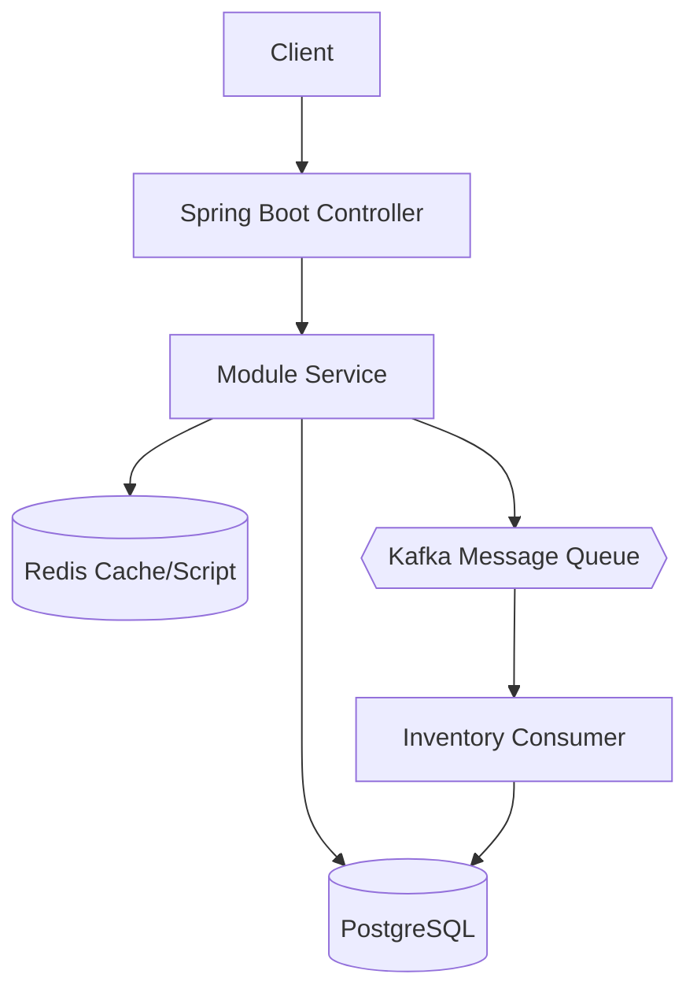
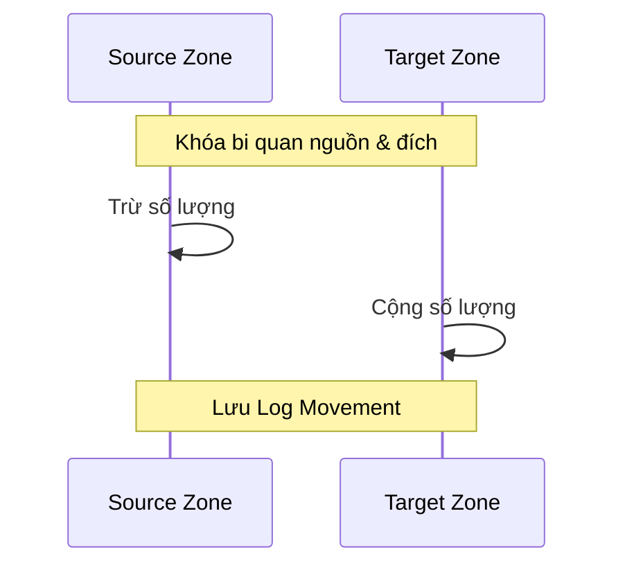
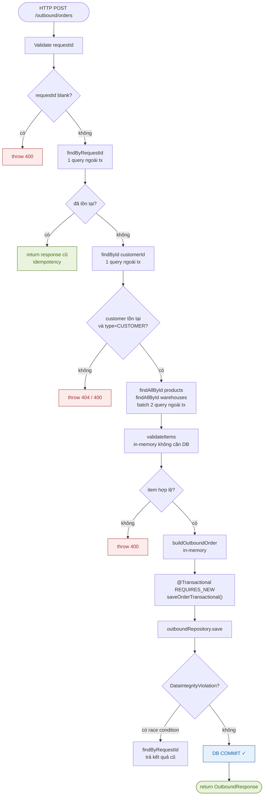
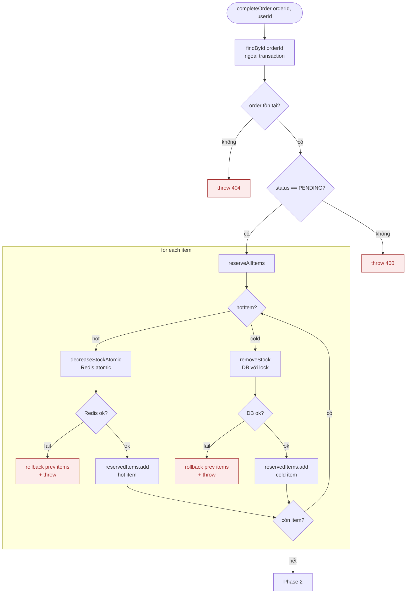
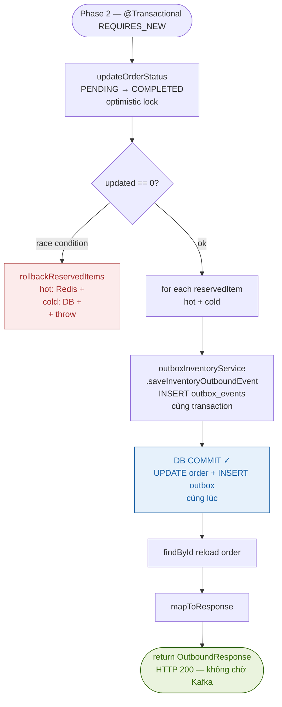
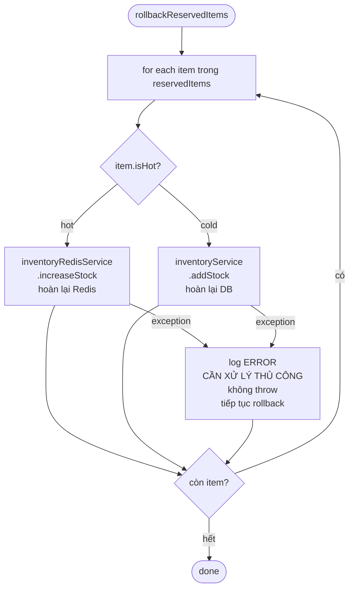
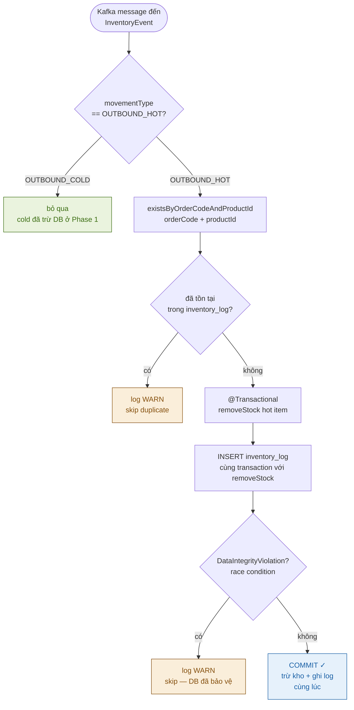
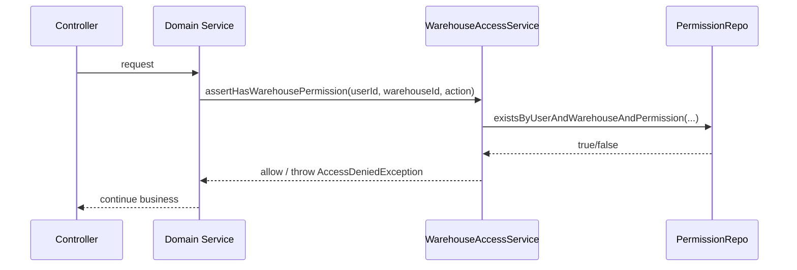

# 🏗️ Kiến Trúc Hệ Thống WMS (ARCHITECTURE)

## 1. Kiến trúc tổng quát (High-Level Architecture)

Hệ thống WMS được thiết kế theo mô hình **Modular Monolith**.

Trong mô hình này, toàn bộ hệ thống được triển khai dưới dạng một ứng dụng duy nhất, nhưng code được chia thành nhiều module theo domain nhằm đảm bảo tính tách biệt logic.

**Các module chính của hệ thống:**

- **Auth**: Quản lý xác thực (JWT) và phân quyền (RBAC).
- **Product**: Quản lý thông tin sản phẩm và Danh mục (Category).
- **Warehouse**: Quản lý kho bãi và các Phân vùng (WarehouseZone).
- **Customer**: Quản lý đối tác (Khách hàng B2B/B2C và Nhà cung cấp).
- **Inventory**: Trái tim của hệ thống, quản lý tồn kho tại từng Zone.
- **Inbound**: Xử lý quy trình nhập hàng.
- **Outbound**: Xử lý quy trình xuất hàng (hỗ trợ hàng Hot qua Redis).

**Luồng dữ liệu tổng quát:**



---

## 2. Quản lý Tồn kho & Đa phân vùng (Multi-zone Support)

Hệ thống hỗ trợ quản lý tồn kho chi tiết đến từng vị trí (Zone/Rack/Bin) trong kho.

### Cấu trúc dữ liệu Tồn kho
Một bản ghi tồn kho (`Inventory`) là sự kết hợp duy nhất của:
- **WarehouseId** + **ProductId** + **ZoneId**

### Nghiệp vụ Chuyển kho (Inventory Transfer)
Cho phép di chuyển hàng hóa giữa các Zone hoặc giữa các Kho khác nhau. Luồng này đảm bảo tính nguyên tử (Atomic) bằng cách sử dụng `@Transactional` và khóa hàng tại cả hai đầu nguồn/đích.



---

## 3. Xử lý đồng thời & Khóa (Concurrency & Locking)

Hệ thống áp dụng chiến lược khóa kép để đảm bảo tính chính xác tuyệt đối của số lượng tồn kho.

### Pessimistic Locking (Khóa bi quan)
Được sử dụng trong các nghiệp vụ Nhập/Xuất/Chuyển kho để tránh tình trạng nhiều tiến trình cùng cập nhật một bản ghi dẫn đến sai lệch số dư.
- Sử dụng cú pháp: `SELECT ... FOR UPDATE` thông qua `@Lock(LockModeType.PESSIMISTIC_WRITE)`.

> [!IMPORTANT]
> **Cơ chế phòng chống Deadlock:** 
> Khi thực hiện Chuyển kho (Transfer), hệ thống luôn thực hiện khóa các bản ghi theo thứ tự định danh (ID) tăng dần. Điều này triệt tiêu vòng lặp chờ chéo giữa các tiến trình chuyển hàng ngược chiều nhau.

### Optimistic Locking (Khóa lạc quan)
Vẫn được duy trì qua trường `@Version` để bảo vệ các dữ liệu ít biến động như thông tin Sản phẩm hoặc Kho.

---

## 4. Cơ chế giao tiếp & Hiệu năng

### Decoupling với Kafka
Để tăng tốc tối đa cho luồng Xuất kho (Outbound), hệ thống không cập nhật Database trực tiếp trong luồng chính của Controller. 
1. `OutboundService` đẩy một `InventoryEvent` vào Kafka.
2. `InventoryConsumer` sẽ lắng nghe và cập nhật DB một cách bất đồng bộ.

### High-Performance với Redis
Các mặt hàng có tần suất giao dịch cực cao (Hot Items) sẽ được:
- **Warmup**: Nạp sẵn vào Redis khi khởi động App.
- **Atomic Update**: Sử dụng LUA Script để trừ tồn kho trên Redis một cách an toàn mà không cần khóa Database ngay lập tức.

---

## 5. Chiến lược dữ liệu (Data Management Strategy)

Tên bảng được đặt theo **prefix module**:

| Prefix | Module | Bảng tiêu biểu |
|--------|--------|----------------|
| `auth_` | Auth | `auth_user`, `auth_role` |
| `prd_` | Product | `prd_product`, `prd_category` |
| `wh_` | Warehouse | `wh_warehouse`, `wh_zone` |
| `cust_` | Customer | `cust_customer` |
| `inv_` | Inventory | `inv_inventory`, `inv_stock_movement` |

---

## 6. Hạ tầng & Triển khai

Hệ thống chạy trên nền tảng Docker với bộ 3: **Spring Boot + PostgreSQL + Redis + Kafka**.

```yaml
services:
  app: # Java 21 Backend
  postgres: # Relational DB
  redis: # Cache & Hot Stock
  kafka: # Event Streaming
  zookeeper: # Kafka Manager
```

---

# WMS Outbound — Complete Workflow Documentation

> Tài liệu này tổng hợp toàn bộ workflow của Outbound Service bao gồm: createOrder, completeOrder, Outbox Pattern và Kafka Consumer idempotency.

---

## Mục lục

1. [Kiến trúc tổng quan](#1-kiến-trúc-tổng-quan)
2. [createOrder](#2-createorder)
3. [completeOrder — 3 Phase](#3-completeorder--3-phase)
4. [Outbox Pattern](#4-outbox-pattern)
5. [Kafka Consumer + Idempotency](#5-kafka-consumer--idempotency)
6. [DB Pool & Transaction Rules](#6-db-pool--transaction-rules)
7. [Checklist Production](#7-checklist-production)

---

## 1. Kiến trúc tổng quan

```
HTTP Request
    │
    ▼
OutboundController
    │
    ├──▶ OutboundOrderService       (createOrder)
    │
    └──▶ OutboundCompleteService    (completeOrder)
              │
              ├── InventoryRedisService   (hot item — Redis)
              ├── InventoryService        (cold item — DB)
              ├── OutboxInventoryService  (ghi outbox_events)
              │
              └── [sau commit] OutboxDispatcher
                                    │
                                    └──▶ Kafka topic: inventory-events
                                                    │
                                                    └──▶ InventoryConsumer
                                                              │
                                                              ├── removeStock()
                                                              └── inventory_log (idempotency)
```

### Package structure

```
com.project.wms
├── outbound
│   ├── controller
│   ├── service
│   │   ├── OutboundOrderService.java        ← createOrder
│   │   └── OutboundCompleteService.java     ← completeOrder
│   ├── dto
│   │   └── ReservedItem.java
│   ├── entity
│   └── repository
│
├── inventory
│   ├── service
│   │   ├── InventoryService.java
│   │   └── InventoryRedisService.java
│   ├── kafka
│   │   ├── InventoryEvent.java
│   │   ├── InventoryProducer.java
│   │   └── InventoryConsumer.java           ← idempotency check
│   └── entity
│       └── InventoryLog.java                ← bảng idempotency
│
└── infrastructure                           ← dùng chung mọi module
    └── outbox
        ├── OutboxEvent.java
        ├── OutboxStatus.java
        ├── OutboxRepository.java
        ├── OutboxService.java
        └── OutboxDispatcher.java            ← @Scheduled mỗi 5s
```

---

## 2. createOrder

### Luồng



### Rules quan trọng

| Rule | Lý do |
|---|---|
| Không `@Transactional` ở `createOrder()` | Tránh giữ connection khi validate |
| Dùng `customerId` thay `customerName` | PK index nhanh hơn full scan |
| Batch load products + warehouses | Tránh N+1 query |
| `buildOutboundOrder()` in-memory | Build object trước, không cần DB |
| `REQUIRES_NEW` chỉ bao `save()` | Transaction ngắn ~3ms |
| `orderCode = "OUT-" + UUID` | Không có space, unique multi-server |

---

## 3. completeOrder — 3 Phase

### Phase 1 — Validate + Reserve (ngoài transaction)



### Phase 2 — Commit DB (transaction ngắn ~3ms)



### Phase 3 — OutboxDispatcher (sau commit, độc lập)

```mermaid
flowchart TD
    A([OutboxDispatcher\n@Scheduled fixedDelay=5000]) --> B[SELECT top 100\nWHERE status=PENDING\nORDER BY created_at ASC]
    B --> C{có rows?}
    C -- không --> D[sleep 5s]
    C -- có --> E[for each event]
    E --> F[sendInventoryEvent\nKafka]
    F --> G{gửi ok?}
    G -- ok --> H[UPDATE status=SENT\nsent_at=now]
    G -- fail --> I{retryCount >= 5?}
    I -- không --> J[retryCount++\ngiữ PENDING\nthử lại lần sau]
    I -- có --> K[status=DEAD\nlog ERROR\ncần xử lý thủ công]
    H --> L{còn event?}
    J --> L
    K --> L
    L -- có --> E
    L -- hết --> M([done — sleep 5s])

    style K fill:#FCEBEB,stroke:#A32D2D,color:#A32D2D
    style M fill:#EAF3DE,stroke:#3B6D11,color:#3B6D11
```

### Rollback logic



---

## 4. Outbox Pattern

### Tại sao cần?

| Vấn đề | Không có Outbox | Có Outbox |
|---|---|---|
| App crash sau DB commit | Event mất vĩnh viễn | Event còn trong DB, retry tự động |
| Kafka down tạm thời | Event mất | Dispatcher retry khi Kafka up lại |
| 2 instance gửi cùng lúc | Consumer nhận 2 lần | Consumer idempotency xử lý |

### Điểm mấu chốt

```
@Transactional
commitOrder() {
    UPDATE outbound_orders SET status=COMPLETED    ─┐
    INSERT outbox_events (status=PENDING)           ─┘ cùng 1 transaction
}
// Hai việc commit cùng nhau hoặc rollback cùng nhau
// Không bao giờ có trường hợp order=COMPLETED nhưng không có outbox event
```

### outbox_events schema

```sql
CREATE TABLE outbox_events (
    id           BIGSERIAL PRIMARY KEY,
    event_type   VARCHAR(100)  NOT NULL,  -- OUTBOUND_HOT | OUTBOUND_COLD
    payload      TEXT          NOT NULL,  -- JSON của InventoryEvent
    topic        VARCHAR(200)  NOT NULL,
    order_code   VARCHAR(100)  NOT NULL,
    status       VARCHAR(20)   NOT NULL DEFAULT 'PENDING',
    created_at   TIMESTAMP     NOT NULL DEFAULT NOW(),
    sent_at      TIMESTAMP,
    retry_count  INT           NOT NULL DEFAULT 0,
    last_error   TEXT
);

-- Index quan trọng — dispatcher query mỗi 5 giây
CREATE INDEX idx_outbox_pending
    ON outbox_events(status, created_at)
    WHERE status = 'PENDING';
```

### OutboxStatus flow

```
PENDING ──▶ SENT      (gửi Kafka thành công)
        ──▶ PENDING   (gửi fail, retryCount < 5 → thử lại)
        ──▶ DEAD      (retryCount >= 5 → cần xử lý thủ công)
```

---

## 5. Kafka Consumer + Idempotency

### Tại sao cần idempotency ở Consumer?

```
Tình huống: Dispatcher gửi Kafka OK → crash trước khi UPDATE status=SENT
→ 5 giây sau Dispatcher chạy lại → gửi lại event
→ Consumer nhận event 2 lần → trừ kho 2 lần ✗
```

### Idempotency key

```
orderCode một mình  ✗  →  1 order nhiều items → conflict
orderCode + productId ✓  →  mỗi item trong order là duy nhất
```

Ví dụ:
```
Order OUT-abc có 3 items:
  OUT-abc + productId=1  →  unique key 1
  OUT-abc + productId=2  →  unique key 2
  OUT-abc + productId=7  →  unique key 3
```

### inventory_log schema

```sql
CREATE TABLE inventory_log (
    id            BIGSERIAL PRIMARY KEY,
    order_code    VARCHAR(100) NOT NULL,
    product_id    BIGINT       NOT NULL,
    quantity      INT          NOT NULL,
    movement_type VARCHAR(50)  NOT NULL,
    created_at    TIMESTAMP    NOT NULL DEFAULT NOW(),

    -- Lớp bảo vệ cuối — DB enforce dù Consumer code bị race condition
    CONSTRAINT uq_inventory_log_order_product
        UNIQUE (order_code, product_id)
);
```

### Consumer flow



### 2 lớp bảo vệ idempotency

| Lớp | Cơ chế | Xử lý |
|---|---|---|
| **1. Code check** | `existsByOrderCodeAndProductId` | Skip trước khi mở transaction |
| **2. DB constraint** | `UNIQUE (order_code, product_id)` | Catch `DataIntegrityViolationException` |

---

## 6. DB Pool & Transaction Rules

### HikariCP config (application.properties)

```properties
spring.datasource.hikari.maximum-pool-size=15
spring.datasource.hikari.minimum-idle=5
spring.datasource.hikari.connection-timeout=3000
spring.datasource.hikari.idle-timeout=600000
spring.datasource.hikari.max-lifetime=1800000
spring.datasource.hikari.leak-detection-threshold=5000
spring.datasource.hikari.pool-name=WMS-HikariPool
spring.jpa.open-in-view=false
spring.jpa.properties.hibernate.jdbc.batch_size=25
```

### Transaction scope rules

```
createOrder()          ← KHÔNG @Transactional
  ├── validate          ngoài tx — không giữ connection
  ├── batch load        ngoài tx — không giữ connection
  └── saveOrder()      @Transactional REQUIRES_NEW — chỉ 1 INSERT ~3ms

completeOrder()        ← KHÔNG @Transactional
  ├── validate          ngoài tx
  ├── reserveAllItems   ngoài tx — Redis + DB lock
  └── commitOrder()    @Transactional REQUIRES_NEW — 1 UPDATE + N INSERT ~5ms
```

### @Transactional trên private method — KHÔNG có tác dụng

```java
// SAI — Spring AOP không proxy được private method
@Transactional
private OutboundResponse commitOrder(...) { }

// ĐÚNG — phải public
@Transactional
public OutboundResponse commitOrder(...) { }
```

---

## 7. Checklist Production

### createOrder
- [ ] `requestId` không blank
- [ ] Idempotency check trước khi tạo
- [ ] Dùng `customerId` thay `customerName`
- [ ] Batch load products + warehouses (tránh N+1)
- [ ] `buildOutboundOrder()` in-memory, không query DB
- [ ] `orderCode = "OUT-" + UUID` — không có space
- [ ] `@Transactional REQUIRES_NEW` chỉ bao `save()`
- [ ] Catch `DataIntegrityViolationException` cho race condition

### completeOrder
- [ ] So sánh `order.getStatus() != OrderStatus.PENDING` (enum, không phải string)
- [ ] `reserveAllItems` rollback items trước nếu fail giữa chừng
- [ ] `rollbackReservedItems` xử lý cả hot (Redis) và cold (DB)
- [ ] `commitOrder()` là `public` (không phải `private`)
- [ ] Optimistic lock với `updateOrderStatus(PENDING → COMPLETED)`
- [ ] Outbox event cho TẤT CẢ items (hot + cold)
- [ ] Reload order sau commit để `mapToResponse` trả status đúng
- [ ] `rollbackReservedItems` không throw trong loop — log ERROR và tiếp tục

### Outbox Pattern
- [ ] `outbox_events` có `idx_outbox_pending` index
- [ ] Dispatcher dùng `fixedDelay` (không phải `fixedRate`)
- [ ] Retry tối đa 5 lần rồi chuyển `DEAD`
- [ ] Cleanup SENT events hàng ngày (cron 3AM)
- [ ] `@EnableScheduling` trong `WmsApplication`
- [ ] `spring.jpa.open-in-view=false`

### Kafka Consumer
- [ ] Idempotency key = `orderCode` + `productId`
- [ ] `inventory_log` có `UNIQUE (order_code, product_id)`
- [ ] `removeStock` + `INSERT inventory_log` trong cùng `@Transactional`
- [ ] Catch `DataIntegrityViolationException` — không re-throw
- [ ] Chỉ xử lý `OUTBOUND_HOT` — cold đã trừ DB ở Phase 1

### DB Pool
- [ ] `maximum-pool-size` = (core × 2) + 1
- [ ] `leak-detection-threshold=5000` — phát hiện transaction giữ connection quá lâu
- [ ] `open-in-view=false`
- [ ] Không có `@Transactional` bao quá rộng (validate + Redis + DB cùng lúc)
## Phase 10 - Warehouse-Level Permission & Low Stock Alert

### 10.1 Muc tieu

Phase 10 bo sung co che phan quyen chi tiet theo kho (warehouse-level ACL) de dam bao:
- Role chi quy dinh quyen global.
- Quyen thao tac thuc te duoc check theo tung kho.
- Check quyen tai service layer truoc khi vao nghiep vu/transaction.

### 10.2 Thiet ke quyen chi tiet (khuyen nghi production)

- Giu Role global: `ROLE_ADMIN`, `ROLE_STAFF`, `ROLE_VIEWER`.
- Them bang permission master:
- `auth_permission(id, code, description)`.
- Code goi y: `INBOUND_CREATE`, `INBOUND_COMPLETE`, `OUTBOUND_CREATE`, `OUTBOUND_COMPLETE`, `INVENTORY_VIEW`, `INVENTORY_ADJUST`.
- Them bang mapping user-quyen-theo-kho:
- `auth_user_warehouse_permission(id, user_id, warehouse_id, permission_id, granted_by, granted_at)`.
- Rang buoc bat buoc:
- `UNIQUE(user_id, warehouse_id, permission_id)`.

### 10.3 Ma tran quyen goi y

- `ROLE_ADMIN`: bypass warehouse permission check (toan he thong).
- `ROLE_STAFF`: bat buoc co permission theo warehouse cho cac thao tac ghi.
- `ROLE_VIEWER`: chi duoc `INVENTORY_VIEW` theo warehouse.

Ap dung theo nghiep vu:
- Inbound `create/complete`: check warehouse cua tung item.
- Outbound `create/complete`: check warehouse cua tung item.
- Inventory transfer: check ca `fromWarehouseId` va `toWarehouseId`.

### 10.4 DTO/API quan tri quyen

DTO:
- `GrantWarehousePermissionRequest(userId, warehouseId, permissionCode)`.
- `RevokeWarehousePermissionRequest(userId, warehouseId, permissionCode)`.
- `WarehousePermissionResponse(userId, warehouseId, permissionCode, grantedAt, grantedBy)`.

API:
- `POST /api/v1/admin/warehouse-permissions/grant`
- `POST /api/v1/admin/warehouse-permissions/revoke`
- `GET /api/v1/admin/users/{userId}/warehouse-permissions`

### 10.5 Diem chen check quyen (service layer)

Tao `WarehouseAccessService`:
- `assertHasWarehousePermission(userId, warehouseId, permissionCode)`.
- `assertHasWarehousePermissionForItems(userId, List<Long> warehouseIds, permissionCode)`.

Chen vao dau cac ham nghiep vu:
- `InboundService.createOrder(...)`
- `InboundService.completeOrder(...)`
- `OutboundService.createOrder(...)`
- `OutboundCompleteService.completeOrder(...)`
- `InventoryService.transferStock(...)`



### 10.6 Thu tu trien khai an toan

1. Tao entity + repository + unique index.
2. Seed permission master data (`auth_permission`).
3. Tao `WarehouseAccessService` + `AccessDeniedException`.
4. Gan check vao service layer (khong chi controller).
5. Them admin API `grant/revoke/list`.
6. Viet test unit (access service) va integration (inbound/outbound bi chan dung permission).

### 10.7 Low Stock Alert (phan con lai cua Phase 10)

- Them `min_stock_threshold` tai `inv_inventory` hoac `prd_product`.
- Tao job dinh ky quet `quantity < threshold`.
- Ghi canh bao vao bang `inv_alert`.
- Optional: publish Kafka event / notify.
- API:
- `GET /api/v1/inventory/alerts?warehouseId=...`
