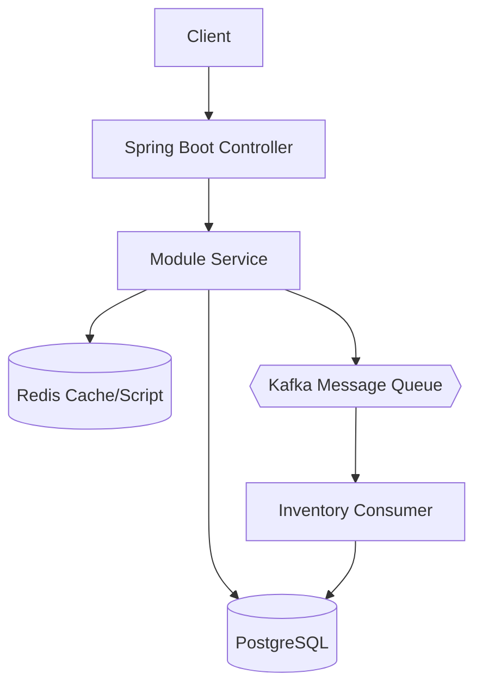
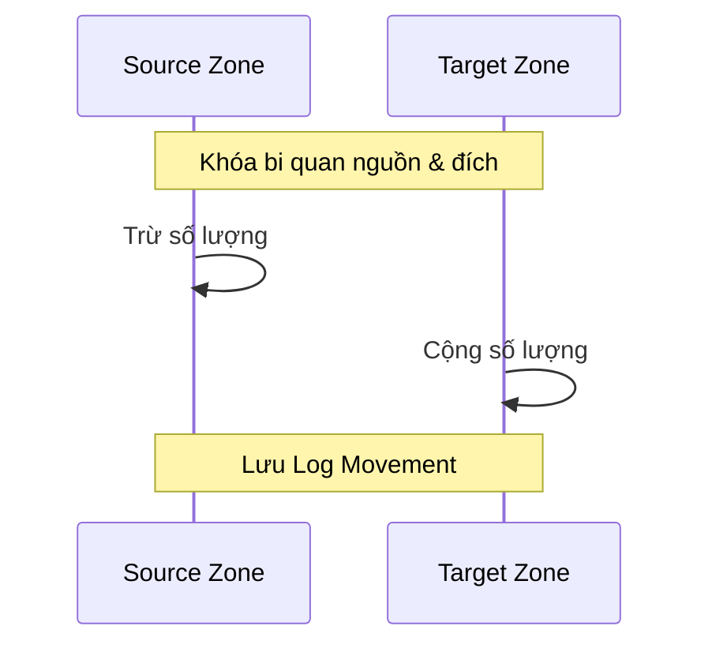

# 🏗️ Kiến Trúc Hệ Thống WMS (ARCHITECTURE)

## 1. Kiến trúc tổng quát (High-Level Architecture)

Hệ thống WMS được thiết kế theo mô hình **Modular Monolith**.

Trong mô hình này, toàn bộ hệ thống được triển khai dưới dạng một ứng dụng duy nhất, nhưng code được chia thành nhiều module theo domain nhằm đảm bảo tính tách biệt logic.

**Các module chính của hệ thống:**

- **Auth**: Quản lý xác thực (JWT) và phân quyền (RBAC).
- **Product**: Quản lý thông tin sản phẩm và Danh mục (Category).
- **Warehouse**: Quản lý kho bãi và các Phân vùng (WarehouseZone).
- **Customer**: Quản lý đối tác (Khách hàng B2B/B2C và Nhà cung cấp).
- **Inventory**: Trái tim của hệ thống, quản lý tồn kho tại từng Zone.
- **Inbound**: Xử lý quy trình nhập hàng.
- **Outbound**: Xử lý quy trình xuất hàng (hỗ trợ hàng Hot qua Redis).

**Luồng dữ liệu tổng quát:**



---

## 2. Quản lý Tồn kho & Đa phân vùng (Multi-zone Support)

Hệ thống hỗ trợ quản lý tồn kho chi tiết đến từng vị trí (Zone/Rack/Bin) trong kho.

### Cấu trúc dữ liệu Tồn kho
Một bản ghi tồn kho (`Inventory`) là sự kết hợp duy nhất của:
- **WarehouseId** + **ProductId** + **ZoneId**

### Nghiệp vụ Chuyển kho (Inventory Transfer)
Cho phép di chuyển hàng hóa giữa các Zone hoặc giữa các Kho khác nhau. Luồng này đảm bảo tính nguyên tử (Atomic) bằng cách sử dụng `@Transactional` và khóa hàng tại cả hai đầu nguồn/đích.



---

## 3. Xử lý đồng thời & Khóa (Concurrency & Locking)

Hệ thống áp dụng chiến lược khóa kép để đảm bảo tính chính xác tuyệt đối của số lượng tồn kho.

### Pessimistic Locking (Khóa bi quan)
Được sử dụng trong các nghiệp vụ Nhập/Xuất/Chuyển kho để tránh tình trạng nhiều tiến trình cùng cập nhật một bản ghi dẫn đến sai lệch số dư.
- Sử dụng cú pháp: `SELECT ... FOR UPDATE` thông qua `@Lock(LockModeType.PESSIMISTIC_WRITE)`.

> [!IMPORTANT]
> **Cơ chế phòng chống Deadlock:** 
> Khi thực hiện Chuyển kho (Transfer), hệ thống luôn thực hiện khóa các bản ghi theo thứ tự định danh (ID) tăng dần. Điều này triệt tiêu vòng lặp chờ chéo giữa các tiến trình chuyển hàng ngược chiều nhau.

### Optimistic Locking (Khóa lạc quan)
Vẫn được duy trì qua trường `@Version` để bảo vệ các dữ liệu ít biến động như thông tin Sản phẩm hoặc Kho.

---

## 4. Cơ chế giao tiếp & Hiệu năng

### Decoupling với Kafka
Để tăng tốc tối đa cho luồng Xuất kho (Outbound), hệ thống không cập nhật Database trực tiếp trong luồng chính của Controller. 
1. `OutboundService` đẩy một `InventoryEvent` vào Kafka.
2. `InventoryConsumer` sẽ lắng nghe và cập nhật DB một cách bất đồng bộ.

### High-Performance với Redis
Các mặt hàng có tần suất giao dịch cực cao (Hot Items) sẽ được:
- **Warmup**: Nạp sẵn vào Redis khi khởi động App.
- **Atomic Update**: Sử dụng LUA Script để trừ tồn kho trên Redis một cách an toàn mà không cần khóa Database ngay lập tức.

---

## 5. Chiến lược dữ liệu (Data Management Strategy)

Tên bảng được đặt theo **prefix module**:

| Prefix | Module | Bảng tiêu biểu |
|--------|--------|----------------|
| `auth_` | Auth | `auth_user`, `auth_role` |
| `prd_` | Product | `prd_product`, `prd_category` |
| `wh_` | Warehouse | `wh_warehouse`, `wh_zone` |
| `cust_` | Customer | `cust_customer` |
| `inv_` | Inventory | `inv_inventory`, `inv_stock_movement` |

---

## 6. Hạ tầng & Triển khai

Hệ thống chạy trên nền tảng Docker với bộ 3: **Spring Boot + PostgreSQL + Redis + Kafka**.

```yaml
services:
  app: # Java 21 Backend
  postgres: # Relational DB
  redis: # Cache & Hot Stock
  kafka: # Event Streaming
  zookeeper: # Kafka Manager
```