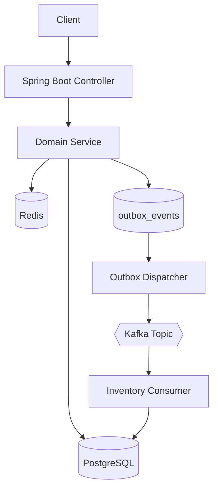

# 🏗️ Kiến Trúc Hệ Thống WMS

## 1. Mục Tiêu Kiến Trúc

WMS được thiết kế theo mô hình **Modular Monolith** để cân bằng giữa:
- Tốc độ phát triển và vận hành (1 deployment).
- Tách biệt domain rõ ràng (module boundaries).
- Sẵn sàng tách microservice trong tương lai khi cần scale.

Nguyên tắc cốt lõi:
- **Safety First**: mọi biến động tồn kho phải nằm trong transaction phù hợp.
- **Deadlock Awareness**: thao tác nhiều bản ghi phải có thứ tự khóa ổn định.
- **Decoupling**: dùng Kafka/Outbox cho luồng bất đồng bộ.

---

## 2. High-Level Architecture

### 2.1 Module chính

- **Auth**: JWT, RBAC, warehouse-level permission.
- **Product**: sản phẩm, category.
- **Warehouse**: kho, zone/rack/bin.
- **Customer**: khách hàng/nhà cung cấp.
- **Inventory**: số dư tồn theo vị trí.
- **Inbound**: nhập kho.
- **Outbound**: xuất kho.
- **Infrastructure**: outbox, scheduler, common utils.

### 2.2 Luồng xử lý tổng quát



---

## 3. Data & Transaction Design

### 3.1 Mô hình dữ liệu tồn kho

Bản ghi tồn kho (`inv_inventory`) là duy nhất theo:
- `warehouse_id`
- `zone_id`
- `product_id`

Khuyến nghị ràng buộc:
- `UNIQUE (warehouse_id, zone_id, product_id)`

### 3.2 Quy tắc transaction

- Không bọc transaction quá rộng (tránh giữ connection khi validate).
- Chỉ bọc phần ghi DB quan trọng trong `@Transactional` ngắn.
- Nghiệp vụ chuyển kho phải atomic (trừ nguồn + cộng đích cùng logical unit).

### 3.3 Quy tắc locking

- Luồng Nhập/Xuất/Chuyển kho dùng `PESSIMISTIC_WRITE` hoặc `SELECT ... FOR UPDATE`.
- Khi khóa từ 2 bản ghi trở lên, luôn khóa theo thứ tự ID tăng dần để giảm deadlock.
- Dữ liệu ít biến động giữ `@Version` để bảo vệ optimistic locking.

---

## 4. Async & Reliability

### 4.1 Outbox Pattern

Mọi event quan trọng phát sang Kafka phải đi qua `outbox_events`:
- Cập nhật nghiệp vụ chính + ghi outbox trong **cùng transaction**.
- Dispatcher gửi lại event theo chu kỳ nếu lỗi.
- Trạng thái: `PENDING -> SENT` hoặc `PENDING -> DEAD` (quá số lần retry).

### 4.2 Idempotency ở Consumer

Consumer phải idempotent để chống xử lý trùng do retry/re-delivery:
- Idempotency key khuyến nghị: `order_code + product_id`.
- DB constraint bắt buộc: `UNIQUE(order_code, product_id)` tại bảng log xử lý.

---

## 5. Security Model

### 5.1 Global Role

- `ROLE_ADMIN`
- `ROLE_STAFF`
- `ROLE_VIEWER`

### 5.2 Warehouse-Level Permission

- Role chỉ xác định phạm vi tổng quát.
- Quyền thực thi nghiệp vụ ghi phải check theo từng kho (`warehouse_id`).
- Check quyền tại **service layer**, không chỉ controller.

Service đề xuất:
- `WarehouseAccessService.assertHasWarehousePermission(...)`

---

## 6. Non-Functional Requirements (NFR)

Các giá trị dưới đây là mục tiêu khởi điểm, cần hiệu chỉnh theo tải thực tế:

- API read P95 < `200ms`.
- API write P95 < `400ms` (không chờ Kafka).
- Outbox dispatch delay trung bình < `5s`.
- Retry outbox tối đa `5` lần trước khi vào `DEAD`.
- RPO mục tiêu: `~0` cho dữ liệu giao dịch DB.
- RTO mục tiêu: `< 60 phút`.

---

## 7. Observability

Bắt buộc gắn correlation fields trong log:
- `requestId`
- `orderCode`
- `warehouseId`
- `productId`

Metrics khuyến nghị:
- `outbox.pending.count`
- `outbox.dead.count`
- `kafka.consumer.lag`
- `inventory.lock.wait.ms`
- `inventory.adjust.fail.count`

Alert tối thiểu:
- `outbox.dead.count > 0`
- consumer lag tăng liên tục
- lock wait time vượt ngưỡng

---

## 8. Failure & Recovery Matrix

| Tình huống | Hành vi mong đợi | Recovery |
|---|---|---|
| Kafka tạm down | Event nằm ở `outbox_events` trạng thái `PENDING` | Dispatcher retry tự động |
| App crash sau DB commit | Không mất event | App lên lại, dispatcher gửi tiếp |
| Redis lỗi tạm thời | Fallback sang DB path (nếu policy cho phép) hoặc fail-fast | Retry theo policy, có cảnh báo |
| Deadlock/lock timeout | Transaction rollback an toàn | Retry có kiểm soát + theo dõi metrics |
| Outbox event vào `DEAD` | Không mất dấu lỗi | Quy trình reprocess thủ công |

---

## 9. Triển Khai Hạ Tầng

```yaml
services:
  app:        # Spring Boot (Java 21)
  postgres:   # Primary relational store
  redis:      # Cache / atomic stock ops cho hot item
  kafka:      # Event streaming
  zookeeper:  # Kafka dependency
```

---

## 10. Tài Liệu Chi Tiết Liên Quan

`ARCHITECTURE.md` chỉ giữ high-level. Chi tiết tách riêng:

- `docs/outbound-workflow.md`: createOrder/completeOrder/outbox/consumer.
- `docs/security/warehouse-acl.md`: thiết kế permission theo kho.
- `docs/runbook/outbox-recovery.md`: xử lý event `DEAD`, reprocess.
- `docs/observability/metrics-alerts.md`: metrics + alert rule.

---

## 11. Quy ước tên bảng

| Prefix | Module | Ví dụ |
|---|---|---|
| `auth_` | Auth | `auth_user`, `auth_role`, `auth_permission` |
| `prd_` | Product | `prd_product`, `prd_category` |
| `wh_` | Warehouse | `wh_warehouse`, `wh_zone` |
| `cust_` | Customer | `cust_customer` |
| `inv_` | Inventory | `inv_inventory`, `inv_stock_movement`, `inv_alert` |
| `outbox_` | Infrastructure | `outbox_events` |

---

## 12. Checklist Kiến Trúc Trước Go-Live

- [ ] Tất cả luồng đổi tồn kho đã bọc transaction đúng phạm vi.
- [ ] Locking strategy đã thống nhất và có thứ tự khóa ổn định.
- [ ] Outbox + dispatcher + retry + DEAD flow đã test.
- [ ] Consumer idempotency có cả code check và DB unique constraint.
- [ ] Warehouse permission được check ở service layer.
- [ ] Metrics/alert quan trọng đã bật trong môi trường production.
- [ ] Có runbook cho tình huống Kafka/Redis/Outbox lỗi.
