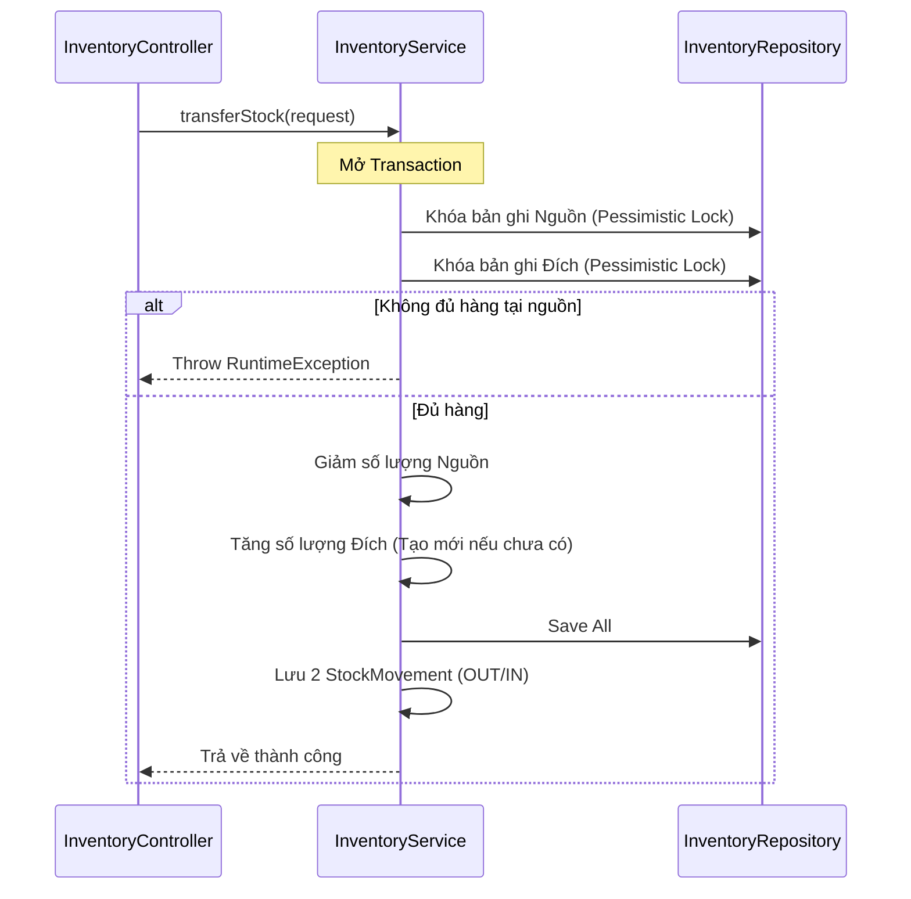

# Kế hoạch triển khai Nghiệp vụ Chuyển kho & Cập nhật Kiến trúc

Nhiệm vụ này bao gồm việc thiết kế luồng chuyển hàng nội bộ giữa các Zone/Warehouse và cập nhật tài liệu kiến trúc để phản ánh thực tế dự án (Kafka, Pessimistic Locking, Multi-zone).

## Proposed Changes

### 1. Module Inventory (DTO & Logic)

#### [NEW] [InventoryTransferRequest.java](file:///d:/My%20Intellj/wms/src/main/java/com/project/wms/inventory/dto/InventoryTransferRequest.java)
- Khai báo các trường: `productId`, `fromWarehouseId`, `fromZoneId`, `toWarehouseId`, `toZoneId`, `quantity`, `referenceCode`.

#### [NEW] [InventoryTransferResponse.java](file:///d:/My%20Intellj/wms/src/main/java/com/project/wms/inventory/dto/InventoryTransferResponse.java)
- Trả về thông tin trạng thái sau khi chuyển thành công.

#### [MODIFY] [InventoryService.java](file:///d:/My%20Intellj/wms/src/main/java/com/project/wms/inventory/service/InventoryService.java)
- Triển khai hàm `transferStock(InventoryTransferRequest request)`.
- Sử dụng `@Transactional` và **Pessimistic Locking** để khóa hai bản ghi tồn kho (nguồn và đích).
- Thực hiện trừ kho nguồn và cộng kho đích.
- Lưu 2 bản ghi biến động số dư (`StockMovement`) loại `TRANSFER_OUT` và `TRANSFER_IN`.

---

### 2. Tài liệu Kiến trúc

#### [MODIFY] [ARCHITECTURE.md](file:///d:/My%20Intellj/wms/ARCHITECTURE.md)
- **Cập nhật Concurrency Control**: Bổ sung phần giải thích về **Pessimistic Locking** (`SELECT ... FOR UPDATE`) bên cạnh Optimistic Locking.
- **Bổ sung Hệ thống sự kiện (Kafka)**: Giải thích cách decoupling giữa Outbound và Inventory thông qua `InventoryProducer`.
- **Bổ sung Cấu trúc Multi-zone**: Giải thích về việc chia nhỏ Kho thành các `WarehouseZone`.
- **Bổ sung Module Đối tác (Partner/Customer)**: Cập nhật ranh giới module mới thêm vào.
- **Sơ đồ luồng Chuyển kho**: Thêm sơ đồ Mermaid cho nghiệp vụ Transfer.

---

## Sơ đồ logic Chuyển kho (Transfer Flow)

## Open Questions

> [!IMPORTANT]
> **Bài toán Deadlock trong Chuyển kho:** 
> Nếu User A chuyển từ Zone 1 -> Zone 2, cùng lúc User B chuyển từ Zone 2 -> Zone 1, sẽ xảy ra hiện tượng "chờ nhau" dẫn đến Deadlock.
> **Giải pháp:** Tôi đề xuất logic luôn khóa bản ghi có ID nhỏ hơn trước để triệt tiêu vòng lặp chờ. Bạn có đồng ý với cách xử lý này không?

## Verification Plan

### Automated Tests
- Viết Integration Test giả lập hai luồng chuyển kho chéo nhau để kiểm tra deadlock.
- Test trường hợp chuyển kho sang vị trí chưa từng có tồn kho (phải tự tạo bản ghi `Inventory` mới).

### Manual Verification
- Sử dụng Postman gọi API chuyển kho và kiểm tra bảng `inv_inventory` cùng `inv_stock_movement`.
